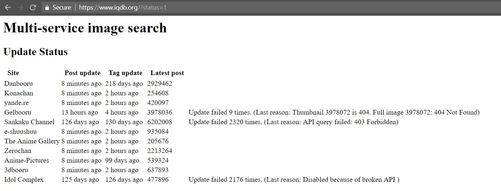
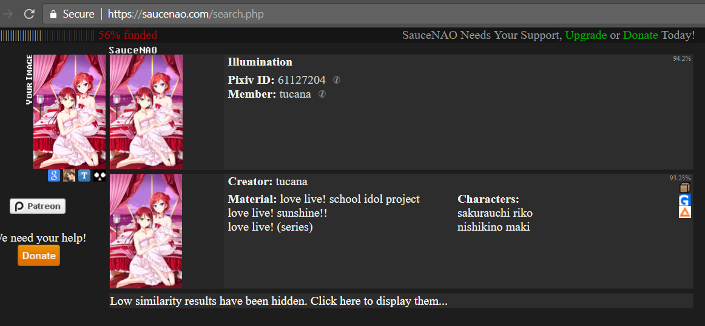
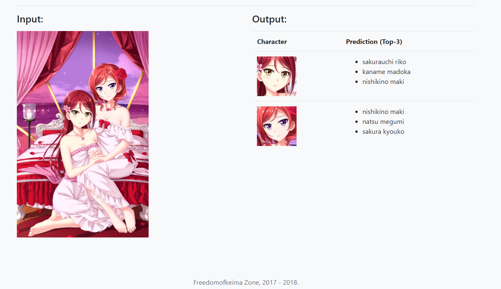
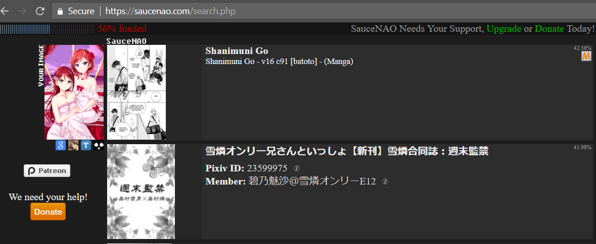
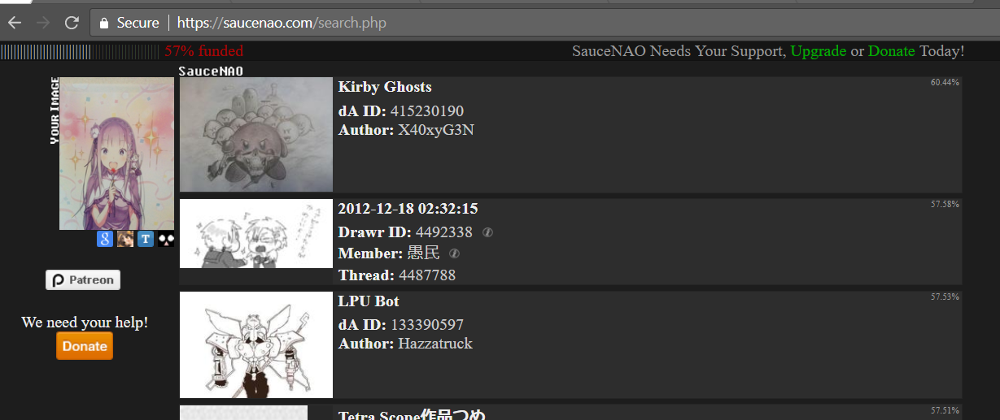
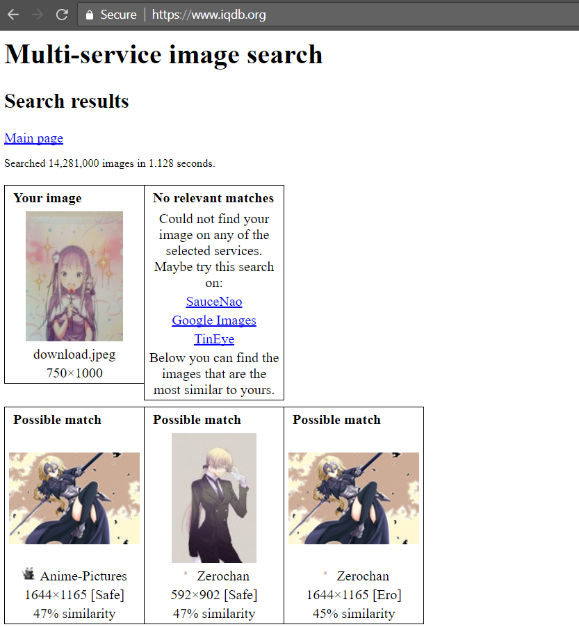
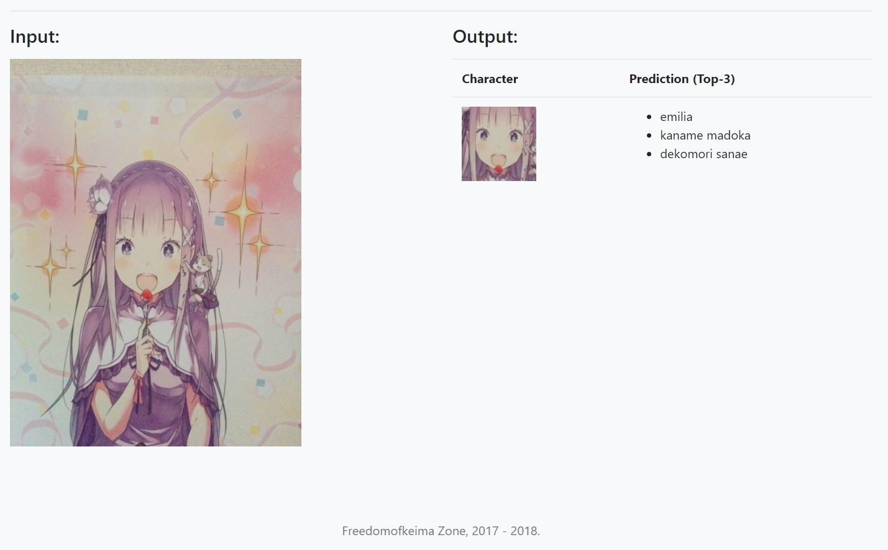

# MoeFlow

[](https://circleci.com/gh/freedomofkeima/MoeFlow/tree/master)

Repository for anime characters recognition website, powered by TensorFlow

## Project Introduction

This project is related to [freedomofkeima/transfer-learning-anime](https://github.com/freedomofkeima/transfer-learning-anime).

### Background

This project is heavily inspired from characters indexing website such as [saucenao](https://saucenao.com/) and [iqdb](https://www.iqdb.org/). In general, character indexing websites work well since character arts are generally limited in terms of number compared to real-life photos.



However, there are cases where character indexing websites will not work well, e.g.: the image is cropped or altered.

**Full Image**





**Altered Image**




Or, there are cases where you want to recognize a character from a photo.







### Transfer Learning

This project only uses [30 images per character](100_class_traning_note.md) for learning, which are very low in number for image recognition learning. However, this number is chosen since the majority of characters has a limited number of arts.

In [yande.re](https://yande.re/tag?name=&order=count&type=4), there are around 35000 registered character tags. However, top 1000 characters only have 70+ images while top 2000 characters only have 40+ images.

## Requirements

- TensorFlow 1.4.0 (`pip install tensorflow==1.4.0` first)
- [nagadomi/animeface-2009](https://github.com/nagadomi/animeface-2009)

## How to create initial environment

Python Environment:

```
$ virtualenv -p python3 venv  # Ensure python3 version is 3.5, otherwise TensorFlow might not work
$ . venv/bin/activate
$ pip install tensorflow==1.4.0
```

Since `nagadomi/animeface-2009` is an independent project, you need to clone it somewhere in your local directory. Note that the project requires Ruby, ImageMagick, and gcc to run.

After you finish installing it, go to `detect.rb` and update the `require` part (line 4) accordingly.

After that, you need to download MoeFlow model via `models/download_model.sh` (~ 100 MB).

## How to run

After running steps above, you can simply run it by:

```
$ export MOEFLOW_MODEL_PATH='/path/to/MoeFlow/models'
$ pip install -e .
$ app
```

## License

This project itself is licensed under MIT License. 

Face recognition feature is developed by [nagadomi](https://github.com/nagadomi).

All images are owned by their respective creators.
